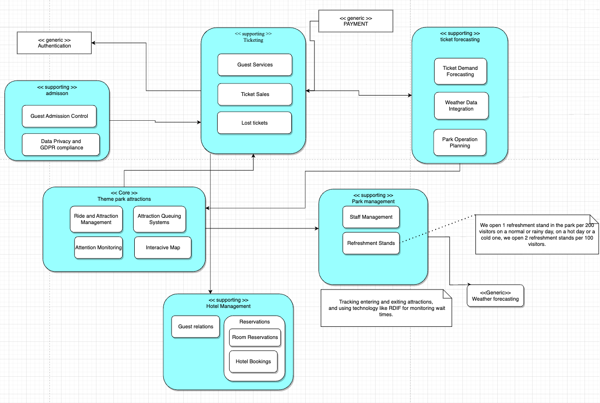

# _Programming 

# Table of Contents

1. [Introduction](#introduction)
2. [Setup](#setup)
3. [Week1](#week1)
4. [Week2](#week2)
5. [Week3](#week3)
6. [Week4](#week4)
7. [Week5](#week5)
8. [Week6](#week6)

## Introduction

Hi, This project is a attraction park. There are 4 implemented bounded contexts

- Ticketing
- Admission
- Park
- Park-Management

### What can you do in this application?

- a user can login and create an account using cloak
- a user can buy a ticket
- scan a ticket in Admission
- Enter the Park
- Leave the Park
- Enter a attraction
- Leave a attraction

## Bounded context communication

- When a ticket is purschased park management receives the event
- When a ticket is scanned at Admission the gate is opened and Park management is notified to add a activity to
  calculate visitors inside
- When there are 80 users in a attraction queue the park management is notified, to adjust the throughput
- when the user leaves the park, the parkmangement is notified to add a activity to calculate visitors inside
- When a Refreshment stand is created by a park management the park is notified to create one aswell
- When a Refreshment stand is removed by a park mangement the park is notified to remove the stand by UUID

## Tests

### Testcontainers

- parkcontrollerintegrationtest - park management

### Smoke Test - Park Management

- user cannot delete a stand twice.
- user can delete a stand with currect UUID
- user cannot delete a stand that doesnt exist

### Stubbing test - Admission

- user enters validates ticket.

### Mocking test - Park management

- Mocking snapshot test
- test to retrieve how many people are in a park from its activityWindow
- test to retrieve how many people are in a park from its activityWindow when a person leaves
- test to retrieve how many people are in a park from its activityWindow, but it should return 0 because they entered
  before the snapshot was taken

### Architecture test - Park management

- test domain depend on other layers

### Unit Test

- Queue Strategy throughput Test - park management
- purchase flow test - ticketing
- pricing strategy test - testing composite pricing strategy - ticketing
-

## Resilience

#### WeatherCheckerService

- has Retryable 8 times with 1000ms delay
- circuit breaker with fallback function

## Security

- jtw/cors for api calls
- realms enabled

## Snapshot

- snapshot available for total park visitors for a particular day, a snapshot is taking every day and you will be able
  to get the current snapshot visitors of that day 

